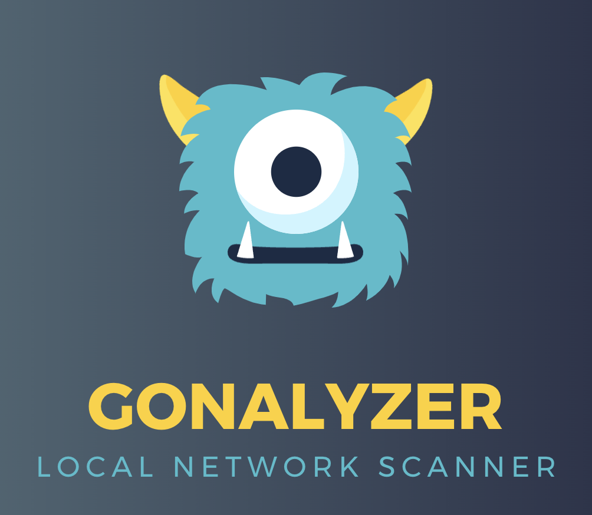

Gonalyzer is a command line tool that detects network interfaces and scans the arp table. Motivation behind this project is to check network status of remote test or build setups.

## Tested OS

- Debian, Ubuntu, macOS

## Tech

Uses [gopacket](https://github.com/google/gopacket) library to scan arp table.

## Installation

```
git clone git@github.com:berkantay/network-gonalyzer.git
cd network-gonalyzer
go build main.go -o gonalyzer
```

use sudo if necessary

```
sudo ./gonalyzer
```

## License

Holy freakin free
